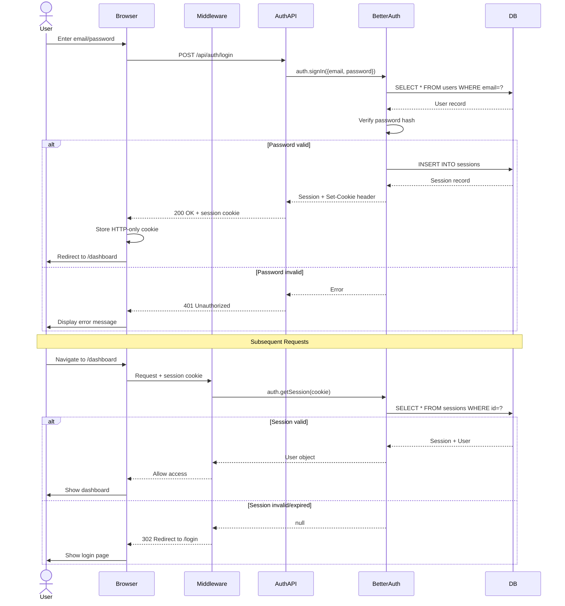

# Backend Architecture

## Service Architecture

### Function Organization (Serverless - Next.js API Routes)

```
/app/api
  /auth
    /register
      route.ts              # POST - User registration
    /login
      route.ts              # POST - User login
    /logout
      route.ts              # POST - User logout
    /callback
      /google
        route.ts            # GET - Google OAuth callback
  /surveys
    route.ts                # GET - List surveys, POST - Create survey
    /[id]
      route.ts              # GET - Get survey, PATCH - Update, DELETE - Delete
      /questions
        route.ts            # POST - Add question
        /[qid]
          route.ts          # PATCH - Update question, DELETE - Delete
        /reorder
          route.ts          # PATCH - Reorder questions
      /responses
        route.ts            # GET - List responses (auth), POST - Submit response (public)
      /analytics
        route.ts            # GET - Get analytics
      /export
        route.ts            # GET - Export to CSV
  /user
    /profile
      route.ts              # GET - Get profile, PATCH - Update profile
  /dashboard
    /stats
      route.ts              # GET - Dashboard statistics
```

### Function Template

```typescript
// app/api/surveys/route.ts

import { NextRequest, NextResponse } from 'next/server';
import { z } from 'zod';
import { prisma } from '@/lib/prisma';
import { getCurrentUser } from '@/lib/auth';
import { createErrorResponse } from '@/lib/errors';

// Validation schema
const createSurveySchema = z.object({
  title: z.string().min(1, 'Title is required').max(200),
  description: z.string().max(1000).optional(),
});

// GET /api/surveys - List all surveys for authenticated user
export async function GET(request: NextRequest) {
  try {
    const user = await getCurrentUser(request);
    if (!user) {
      return createErrorResponse('Unauthorized', 401);
    }

    const surveys = await prisma.survey.findMany({
      where: { userId: user.id },
      orderBy: { updatedAt: 'desc' },
      include: {
        _count: {
          select: { responses: true },
        },
      },
    });

    return NextResponse.json({ surveys }, { status: 200 });
  } catch (error) {
    console.error('Error fetching surveys:', error);
    return createErrorResponse('Failed to fetch surveys', 500);
  }
}

// POST /api/surveys - Create new survey
export async function POST(request: NextRequest) {
  try {
    const user = await getCurrentUser(request);
    if (!user) {
      return createErrorResponse('Unauthorized', 401);
    }

    const body = await request.json();
    const validatedData = createSurveySchema.parse(body);

    const survey = await prisma.survey.create({
      data: {
        userId: user.id,
        title: validatedData.title,
        description: validatedData.description,
        uniqueId: generateUniqueId(), // 8-char unique ID for public URLs
        status: 'draft',
      },
    });

    return NextResponse.json(survey, { status: 201 });
  } catch (error) {
    if (error instanceof z.ZodError) {
      return createErrorResponse('Validation error', 400, error.errors);
    }
    console.error('Error creating survey:', error);
    return createErrorResponse('Failed to create survey', 500);
  }
}

// Helper function to generate unique ID
function generateUniqueId(): string {
  const chars = 'abcdefghijklmnopqrstuvwxyzABCDEFGHIJKLMNOPQRSTUVWXYZ0123456789';
  let result = '';
  for (let i = 0; i < 8; i++) {
    result += chars.charAt(Math.floor(Math.random() * chars.length));
  }
  return result;
}
```

---

## Database Architecture

### Schema Design

*See Database Schema section above for complete Prisma schema*

### Data Access Layer (Repository Pattern)

```typescript
// lib/repositories/survey-repository.ts

import { prisma } from '@/lib/prisma';
import type { Survey, SurveyStatus, Prisma } from '@prisma/client';

export class SurveyRepository {
  // Find surveys by user ID
  async findByUserId(userId: string): Promise<Survey[]> {
    return prisma.survey.findMany({
      where: { userId },
      orderBy: { updatedAt: 'desc' },
      include: {
        questions: {
          orderBy: { order: 'asc' },
        },
        _count: {
          select: { responses: true },
        },
      },
    });
  }

  // Find survey by unique ID (for public access)
  async findByUniqueId(uniqueId: string): Promise<Survey | null> {
    return prisma.survey.findUnique({
      where: { uniqueId },
      include: {
        questions: {
          orderBy: { order: 'asc' },
        },
      },
    });
  }

  // Find survey by ID with authorization check
  async findByIdForUser(surveyId: string, userId: string): Promise<Survey | null> {
    return prisma.survey.findFirst({
      where: {
        id: surveyId,
        userId,
      },
      include: {
        questions: {
          orderBy: { order: 'asc' },
        },
      },
    });
  }

  // Create survey
  async create(data: {
    userId: string;
    title: string;
    description?: string;
    uniqueId: string;
  }): Promise<Survey> {
    return prisma.survey.create({
      data: {
        ...data,
        status: 'draft',
      },
    });
  }

  // Update survey
  async update(
    surveyId: string,
    updates: Partial<Pick<Survey, 'title' | 'description' | 'status'>>
  ): Promise<Survey> {
    return prisma.survey.update({
      where: { id: surveyId },
      data: updates,
    });
  }

  // Delete survey (cascades to questions and responses)
  async delete(surveyId: string): Promise<void> {
    await prisma.survey.delete({
      where: { id: surveyId },
    });
  }

  // Get response count for survey
  async getResponseCount(surveyId: string): Promise<number> {
    return prisma.response.count({
      where: { surveyId },
    });
  }
}

export const surveyRepository = new SurveyRepository();
```

---

## Authentication and Authorization

### Auth Flow



### Middleware/Guards

```typescript
// lib/auth.ts - Authentication utilities

import { cookies } from 'next/headers';
import { auth } from '@/lib/better-auth';
import type { User } from '@prisma/client';

// Get current user from session
export async function getCurrentUser(): Promise<User | null> {
  const cookieStore = cookies();
  const sessionCookie = cookieStore.get('session');

  if (!sessionCookie) {
    return null;
  }

  try {
    const session = await auth.getSession(sessionCookie.value);
    return session?.user || null;
  } catch (error) {
    console.error('Error getting session:', error);
    return null;
  }
}

// Require authentication or throw error
export async function requireAuth(): Promise<User> {
  const user = await getCurrentUser();

  if (!user) {
    throw new Error('Unauthorized');
  }

  return user;
}

// Check if user owns resource
export async function requireOwnership(
  resourceUserId: string
): Promise<User> {
  const user = await requireAuth();

  if (user.id !== resourceUserId) {
    throw new Error('Forbidden');
  }

  return user;
}
```

---
