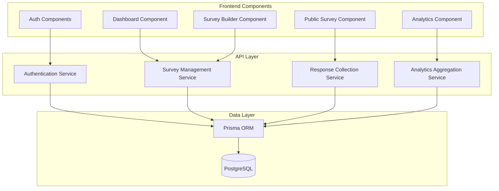

# Components

## Frontend Components

### Survey Builder Component
**Responsibility:** Provides the core drag-and-drop survey creation interface with real-time preview and question editing.

**Key Interfaces:**
- `<SurveyBuilder surveyId={string}>` - Main survey builder container
- `<QuestionPalette onAddQuestion={handler}>` - Question type selector
- `<QuestionEditor question={Question} onUpdate={handler}>` - Individual question editor
- `<QuestionList questions={Question[]} onReorder={handler}>` - Drag-drop question list

**Dependencies:** Survey API, shadcn/ui components (drag-drop from dnd-kit), Zod validation

**Technology Stack:** React 19, TypeScript, @dnd-kit/core for drag-and-drop, React Hook Form for question forms

---

### Dashboard Component
**Responsibility:** Displays user's survey list with status badges, metrics, and quick actions (edit, duplicate, archive, view responses).

**Key Interfaces:**
- `<Dashboard>` - Main dashboard container fetching user surveys
- `<SurveyCard survey={Survey} onAction={handler}>` - Individual survey card with metrics
- `<EmptyState onCreate={handler}>` - Empty state when no surveys exist

**Dependencies:** Survey API, Dashboard Stats API

**Technology Stack:** React 19, TypeScript, shadcn/ui Card components, tanstack/react-query for data fetching

---

### Public Survey Component
**Responsibility:** Renders survey for respondents with question rendering, conditional logic evaluation, and submission handling.

**Key Interfaces:**
- `<PublicSurvey uniqueId={string}>` - Main public survey view
- `<QuestionRenderer question={Question} onChange={handler}>` - Renders question based on type
- `<ConditionalLogicEvaluator logic={Logic} answers={Answers}>` - Evaluates show/hide logic

**Dependencies:** Survey API (public endpoint), Response API

**Technology Stack:** React 19, TypeScript, React Hook Form, Zod validation

---

### Analytics Dashboard Component
**Responsibility:** Visualizes survey response data with charts (bar, pie) and provides data table view with filtering.

**Key Interfaces:**
- `<AnalyticsDashboard surveyId={string}>` - Main analytics container
- `<QuestionChart question={Question} data={AnalyticsData}>` - Chart renderer per question
- `<ResponseTable responses={Response[]} onFilter={handler}>` - Tabular response view

**Dependencies:** Analytics API, Recharts library, Papa Parse for CSV export

**Technology Stack:** React 19, TypeScript, Recharts, shadcn/ui Table components

---

## Backend Components

### Authentication Service
**Responsibility:** Handles user registration, login (email/password and OAuth), session management, and password resets.

**Key Interfaces:**
- `POST /api/auth/register` - Create new user account
- `POST /api/auth/login` - Authenticate user and create session
- `POST /api/auth/logout` - Destroy session
- `GET /api/auth/callback/google` - OAuth callback handler

**Dependencies:** better-auth library, Prisma (User model), Email service

**Technology Stack:** Next.js API Routes, better-auth, Prisma ORM, bcrypt for password hashing

---

### Survey Management Service
**Responsibility:** CRUD operations for surveys and questions, including draft/publish status management and conditional logic storage.

**Key Interfaces:**
- `GET /api/surveys` - List user's surveys
- `POST /api/surveys` - Create new survey
- `PATCH /api/surveys/[id]` - Update survey metadata/status
- `POST /api/surveys/[id]/questions` - Add question
- `PATCH /api/surveys/[id]/questions/[qid]` - Update question
- `DELETE /api/surveys/[id]/questions/[qid]` - Delete question

**Dependencies:** Prisma (Survey, Question models), Auth middleware

**Technology Stack:** Next.js API Routes, Prisma ORM, Zod validation

---

### Response Collection Service
**Responsibility:** Accepts and validates survey responses from public endpoints, stores in database with timestamp and metadata.

**Key Interfaces:**
- `POST /api/surveys/[id]/responses` - Submit response (public, no auth)
- `GET /api/surveys/[id]/responses` - Fetch responses (authenticated, owner only)

**Dependencies:** Prisma (Response model), Zod validation, Rate limiting middleware

**Technology Stack:** Next.js API Routes, Prisma ORM, Zod validation

---

### Analytics Aggregation Service
**Responsibility:** Aggregates response data for analytics dashboard, calculates distributions for charts, and generates CSV exports.

**Key Interfaces:**
- `GET /api/surveys/[id]/analytics` - Get aggregated analytics data
- `GET /api/surveys/[id]/export` - Export responses to CSV
- `GET /api/dashboard/stats` - Get user-level statistics

**Dependencies:** Prisma (Response model), Papa Parse for CSV generation

**Technology Stack:** Next.js API Routes, Prisma ORM with aggregation queries, Papa Parse

---

## Component Diagrams

---
