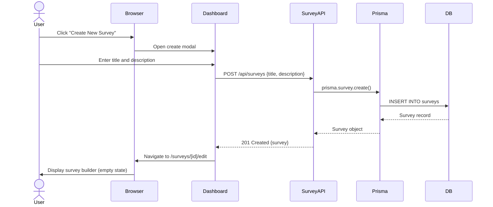
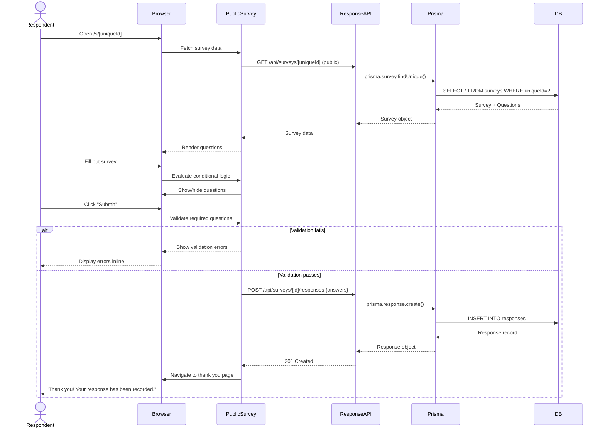
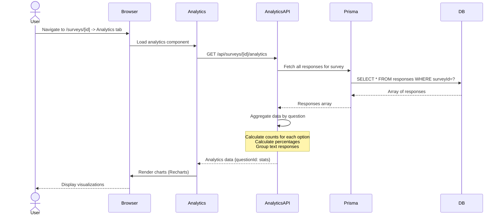

# Core Workflows

## Survey Creation Workflow

```mermaid
sequenceDiagram
    actor User
    participant Browser
    participant Dashboard
    participant SurveyAPI
    participant Prisma
    participant DB

    User->>Browser: Click "Create New Survey"
    Browser->>Dashboard: Open create modal
    User->>Dashboard: Enter title and description
    Dashboard->>SurveyAPI: POST /api/surveys {title, description}
    SurveyAPI->>Prisma: prisma.survey.create()
    Prisma->>DB: INSERT INTO surveys
    DB-->>Prisma: Survey record
    Prisma-->>SurveyAPI: Survey object
    SurveyAPI-->>Dashboard: 201 Created {survey}
    Dashboard->>Browser: Navigate to /surveys/[id]/edit
    Browser->>User: Display survey builder (empty state)
```

## Survey Response Submission Workflow

```mermaid
sequenceDiagram
    actor Respondent
    participant Browser
    participant PublicSurvey
    participant ResponseAPI
    participant Prisma
    participant DB

    Respondent->>Browser: Open /s/[uniqueId]
    Browser->>PublicSurvey: Fetch survey data
    PublicSurvey->>ResponseAPI: GET /api/surveys/[uniqueId] (public)
    ResponseAPI->>Prisma: prisma.survey.findUnique()
    Prisma->>DB: SELECT * FROM surveys WHERE uniqueId=?
    DB-->>Prisma: Survey + Questions
    Prisma-->>ResponseAPI: Survey object
    ResponseAPI-->>PublicSurvey: Survey data
    PublicSurvey-->>Browser: Render questions

    Respondent->>Browser: Fill out survey
    Browser->>PublicSurvey: Evaluate conditional logic
    PublicSurvey->>Browser: Show/hide questions

    Respondent->>Browser: Click "Submit"
    Browser->>PublicSurvey: Validate required questions
    alt Validation fails
        PublicSurvey-->>Browser: Show validation errors
        Browser-->>Respondent: Display errors inline
    else Validation passes
        PublicSurvey->>ResponseAPI: POST /api/surveys/[id]/responses {answers}
        ResponseAPI->>Prisma: prisma.response.create()
        Prisma->>DB: INSERT INTO responses
        DB-->>Prisma: Response record
        Prisma-->>ResponseAPI: Response object
        ResponseAPI-->>PublicSurvey: 201 Created
        PublicSurvey->>Browser: Navigate to thank you page
        Browser-->>Respondent: "Thank you! Your response has been recorded."
    end
```

## Analytics Generation Workflow

```mermaid
sequenceDiagram
    actor User
    participant Browser
    participant Analytics
    participant AnalyticsAPI
    participant Prisma
    participant DB

    User->>Browser: Navigate to /surveys/[id] -> Analytics tab
    Browser->>Analytics: Load analytics component
    Analytics->>AnalyticsAPI: GET /api/surveys/[id]/analytics
    AnalyticsAPI->>Prisma: Fetch all responses for survey
    Prisma->>DB: SELECT * FROM responses WHERE surveyId=?
    DB-->>Prisma: Array of responses
    Prisma-->>AnalyticsAPI: Responses array

    AnalyticsAPI->>AnalyticsAPI: Aggregate data by question
    Note over AnalyticsAPI: Calculate counts for each option<br/>Calculate percentages<br/>Group text responses

    AnalyticsAPI-->>Analytics: Analytics data {questionId: stats}
    Analytics->>Browser: Render charts (Recharts)
    Browser-->>User: Display visualizations
```

---
