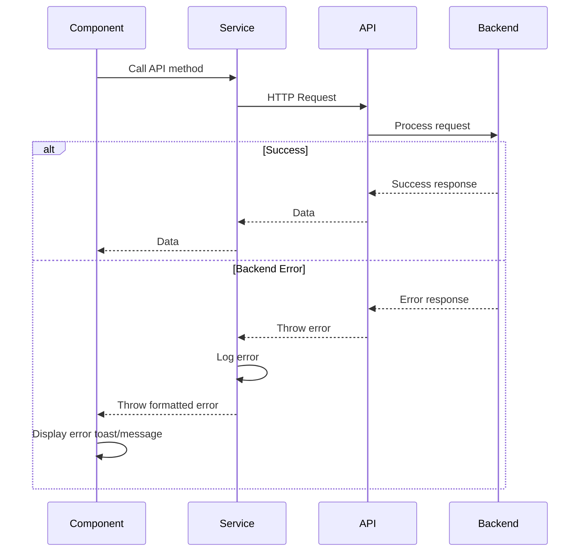

# Error Handling Strategy

## Error Flow



## Error Response Format

```typescript
// lib/errors.ts

interface ApiError {
  error: {
    code: string;
    message: string;
    details?: Record<string, any>;
    timestamp: string;
    requestId: string;
  };
}

export function createErrorResponse(
  message: string,
  status: number,
  details?: any
): NextResponse {
  const error: ApiError = {
    error: {
      code: getErrorCode(status),
      message,
      details,
      timestamp: new Date().toISOString(),
      requestId: generateRequestId(),
    },
  };

  return NextResponse.json(error, { status });
}

function getErrorCode(status: number): string {
  const codes: Record<number, string> = {
    400: 'BAD_REQUEST',
    401: 'UNAUTHORIZED',
    403: 'FORBIDDEN',
    404: 'NOT_FOUND',
    409: 'CONFLICT',
    500: 'INTERNAL_SERVER_ERROR',
  };
  return codes[status] || 'UNKNOWN_ERROR';
}
```

---

## Frontend Error Handling

```typescript
// lib/api/survey-service.ts

import { toast } from '@/components/ui/use-toast';

export const surveyService = {
  async createSurvey(input: CreateSurveyInput): Promise<Survey> {
    try {
      const response = await apiClient.post('/surveys', input);
      return response.data;
    } catch (error) {
      if (axios.isAxiosError(error)) {
        const apiError = error.response?.data?.error;

        // Log error for debugging
        console.error('Create survey error:', apiError);

        // Show user-friendly toast notification
        toast({
          title: 'Failed to create survey',
          description: apiError?.message || 'An unexpected error occurred',
          variant: 'destructive',
        });

        throw new Error(apiError?.message || 'Failed to create survey');
      }
      throw error;
    }
  },
};
```

---

## Backend Error Handling

```typescript
// app/api/surveys/route.ts

export async function POST(request: NextRequest) {
  try {
    const user = await getCurrentUser(request);
    if (!user) {
      return createErrorResponse('Unauthorized', 401);
    }

    const body = await request.json();
    const validatedData = createSurveySchema.parse(body);

    const survey = await prisma.survey.create({
      data: {
        userId: user.id,
        title: validatedData.title,
        description: validatedData.description,
        uniqueId: generateUniqueId(),
        status: 'draft',
      },
    });

    return NextResponse.json(survey, { status: 201 });
  } catch (error) {
    // Validation error (Zod)
    if (error instanceof z.ZodError) {
      return createErrorResponse('Validation error', 400, {
        fields: error.errors.map((e) => ({
          field: e.path.join('.'),
          message: e.message,
        })),
      });
    }

    // Prisma unique constraint error
    if (error instanceof Prisma.PrismaClientKnownRequestError) {
      if (error.code === 'P2002') {
        return createErrorResponse('Duplicate entry', 409);
      }
    }

    // Generic error
    console.error('Unexpected error in POST /api/surveys:', error);
    return createErrorResponse('Internal server error', 500);
  }
}
```

---
