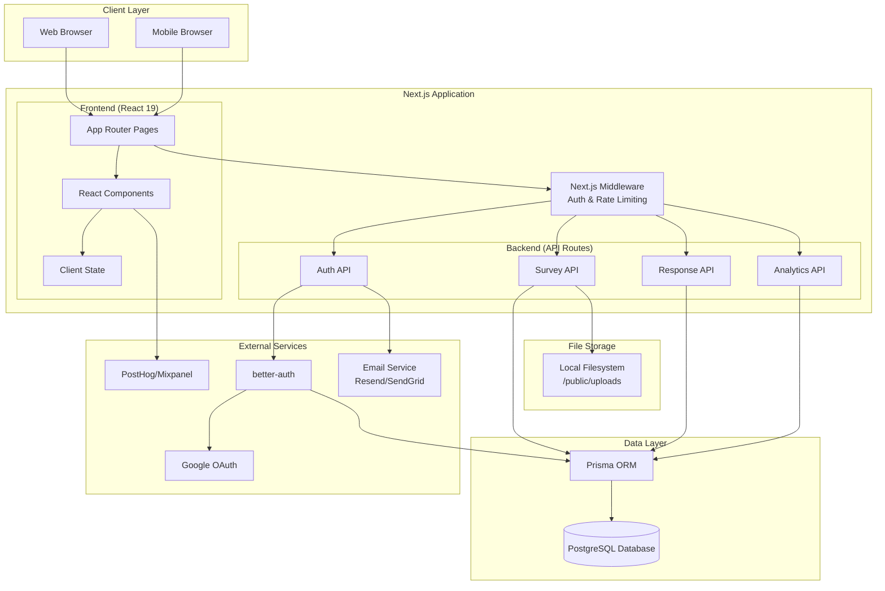

# High Level Architecture

## Technical Summary

Survey.fatihoune.com is built as a **monolithic Next.js 16 application** leveraging the App Router for unified server and client rendering. The architecture follows a **modern Jamstack pattern** with Server-Side Rendering (SSR) for public survey pages and Client-Side Rendering (CSR) for authenticated dashboards and interactive survey builders. Backend logic is implemented through **Next.js API Routes** deployed as serverless functions, with **Prisma ORM** providing type-safe database access to **PostgreSQL**. The frontend uses **React 19** with **TypeScript 5.x** for type safety, **Tailwind CSS 4.x** for styling, and **shadcn/ui** components for consistent, accessible UI patterns. Authentication is handled by **better-auth** with support for email/password and Google OAuth flows. Development occurs on **Vercel** for rapid iteration, while production deploys to **self-hosted infrastructure** for cost control and flexibility. This architecture achieves the PRD's performance goals (page loads < 2s, TTI < 3s, response submission < 500ms) through Next.js optimizations, efficient database queries, and strategic use of server/client rendering patterns.

## Platform and Infrastructure Choice

**Platform:** Hybrid - Vercel (Development) / Self-Hosted (Production)

**Key Services:**
- **Development Platform**: Vercel for fast iteration, preview deployments, and CI/CD integration
- **Production Platform**: Self-hosted infrastructure (VPS, dedicated server, or containerized deployment)
- **Database**: PostgreSQL (Railway, Supabase, or self-managed instance)
- **Authentication**: better-auth library with database session storage
- **File Storage**: Local filesystem (`/public/uploads` or dedicated directory)
- **Email Service**: Resend or SendGrid for transactional emails
- **Analytics**: PostHog or Mixpanel for product analytics
- **Monitoring**: Sentry (optional, post-MVP) for error tracking

**Deployment Host and Regions:**
- **Development**: Vercel global edge network (automatic region selection)
- **Production**: Self-hosted in single region initially (expand as needed based on user geography)

**Rationale:**
- Vercel provides excellent DX for Next.js development with zero-config deployments and instant preview URLs
- Self-hosted production gives full control over costs, data sovereignty, and infrastructure scaling
- PostgreSQL provides relational integrity for survey/response data with excellent Prisma support
- better-auth offers modern, flexible authentication without vendor lock-in

## Repository Structure

**Structure:** Monorepo (single repository)

**Monorepo Tool:** Native Next.js structure with npm workspaces (lightweight, no additional tooling needed for MVP)

**Package Organization:**
- Single Next.js application containing both frontend and backend
- Shared types, utilities, and constants within `/lib` directory
- Clear separation between `/app` (routes/pages), `/components` (UI), and `/lib` (business logic)
- Prisma schema and migrations in `/prisma` directory
- Future: Can migrate to Turborepo or Nx if additional packages/apps are needed post-MVP

**Rationale:** For an MVP timeline (8-12 weeks) with 1-2 developers, a simple monorepo structure within Next.js provides maximum velocity without monorepo tooling overhead. All code sharing happens through standard imports with TypeScript path aliases.

## High Level Architecture Diagram

## Architectural Patterns

- **Jamstack Architecture:** Static site generation for marketing pages with serverless API routes for dynamic functionality - _Rationale:_ Optimal performance and scalability for content-heavy applications while maintaining dynamic survey functionality

- **Server-Side Rendering (SSR):** Public survey pages rendered on server for SEO and initial load performance - _Rationale:_ Ensures survey links are crawlable and respondents experience fast initial page loads regardless of device

- **Client-Side Rendering (CSR):** Authenticated dashboard and survey builder use client-side React for rich interactivity - _Rationale:_ Survey builder requires complex drag-and-drop and real-time preview that benefits from client-side reactivity

- **API Routes as Backend:** Next.js API routes serve as RESTful backend without separate server - _Rationale:_ Reduces architectural complexity and deployment overhead for MVP while leveraging Next.js built-in capabilities

- **Repository Pattern:** Data access abstracted through Prisma ORM with typed models - _Rationale:_ Enables testing, provides type safety, and facilitates future database migration if needed

- **Composition Pattern:** UI built from small, reusable shadcn/ui components - _Rationale:_ Maintainability and consistency across survey builder and dashboard interfaces

- **Optimistic UI Updates:** Client-side state updates before server confirmation for perceived performance - _Rationale:_ Enhances user experience in survey builder during question editing and reordering

- **Progressive Enhancement:** Core survey functionality works without JavaScript, enhanced with interactive features - _Rationale:_ Ensures survey respondents can submit responses even with JavaScript disabled or slow connections

---
